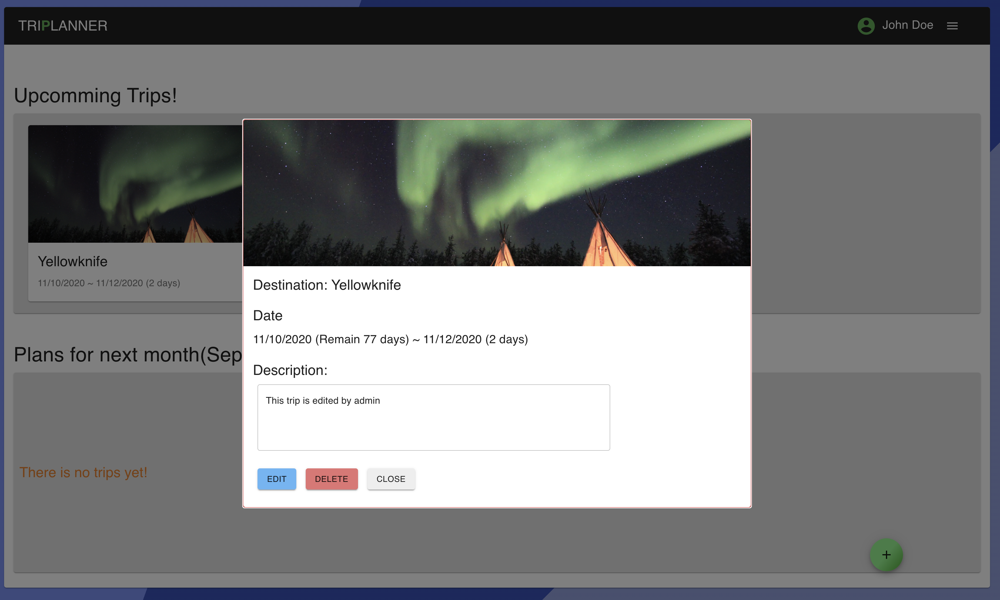

# Triplanner

## Overview

Web application for managing travel plan. 

## Functions
- Sign in / Sign out
- User can Create / Read / Update / Delete plan for own.
- Manager can CRUD user
- Admin can CRUD user and user's plans.
- Future trips should show day count
- Trips can filtered (user: date, destination / admin: user, date, destination)
- Trips for next month can be printed

## Backend
- REST APIs

## Datastructure
- User
  - id: String (UUIDv4)
  - password: String (aes256)
  - name: String
  - role: Number

- Trip
  - id: String (nanoid)
  - startDate: String(YYYY-MM-DD format)
  - endDate: String
  - destination: String
  - Comment: String
  - userId: User.id

## Router
- index:
  - Sign in page
  - If auth expired or not authed, redirect to index
- trips:
  - Show list of upcomming plans and next month's as a plat list
  - Click plan can open plan detail as a modal
- browse:
  - Show list of all trips of users
  - Admin can show whole trips of users
- manage-user:
  - Show list of users
  - Admin can CRUD user's detail

